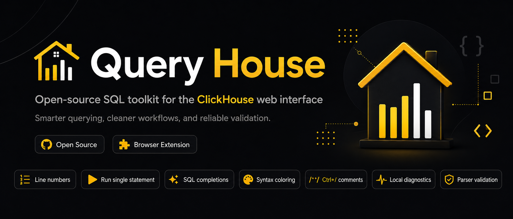

<p align="center">
  
</p>

<p align="center">
  
  
  
  
  
</p>

<h1 align="center">QueryHouse</h1>

<p align="center">
  Open-source SQL editor helpers for the ClickHouse web interface.
</p>

<p align="center">
  <a href="#features">Features</a> ·
  <a href="#install-locally">Install locally</a> ·
  <a href="#test-in-chrome">Test in Chrome</a> ·
  <a href="#development">Development</a> ·
  <a href="#project-map">Project map</a>
</p>

## Why QueryHouse

QueryHouse is a Chrome-compatible MV3 extension that improves textarea-based ClickHouse SQL editors without replacing the host page. It adds line numbers, per-statement actions, SQL completions, syntax coloring, comment shortcuts, and validation while still running queries through the page's native controls.

## Supported Pages

The extension currently runs on:

- `http://localhost/*`
- `http://127.0.0.1/*`
- `https://clickhouse.hamtadns.com/*`

## Features

| Feature | Description |
| --- | --- |
| SQL editor detection | Detects supported ClickHouse SQL textareas and mounts QueryHouse only where it can help. |
| Line numbers | Adds a stable gutter with line numbers and unnumbered action rows for statement controls. |
| Run single statement | Shows `Run | +Tab | JSON` above completed statements and executes one statement through the host page's Run button. |
| Static ClickHouse autocomplete | Suggests ClickHouse SQL keywords, including `FINAL`, `PREWHERE`, `QUALIFY`, `SAMPLE`, `LIMIT BY`, `SETTINGS`, and `FORMAT`. |
| Syntax coloring | Colors SQL keywords and comments without adding a blue current-statement background. |
| Comment shortcut | Toggles `--` line comments with `Ctrl+/` or `Cmd+/` for the current line or selected rows. |
| Local diagnostics | Catches obvious mistakes such as dangling commas, unclosed strings, unmatched brackets, duplicated semicolons, missing trailing semicolons, and invalid `FINAL AS alias` ordering. |
| Parser validation | Runs parser-based validation with `@clickhouse/parser`. |

## Install Locally

Clone the project and install dependencies:

```bash
npm install
```

Build the unpacked Chrome extension:

```bash
npm run build
```

The build output is generated at:

```text
.output/chrome-mv3
```

## Test In Chrome

1. Open `chrome://extensions`.
2. Enable Developer mode.
3. Click Load unpacked.
4. Select `.output/chrome-mv3`.
5. Open a supported ClickHouse web interface.
6. After rebuilding, click the extension reload button in `chrome://extensions` and refresh the ClickHouse page.

## Development

Start WXT development mode:

```bash
npm run dev
```

Build the Chrome MV3 extension:

```bash
npm run build
```

Run the full validation set before committing:

```bash
npm test
npm run typecheck
npm run lint
npm run build
```

## Project Map

| Path | Responsibility |
| --- | --- |
| `entrypoints/content.ts` | Mounts the content script. |
| `src/content/app.ts` | Coordinates editor detection, completions, diagnostics, run actions, and keyboard shortcuts. |
| `src/content/autocomplete-ui.ts` | Renders the completion popup. |
| `src/content/run-statement-ui.ts` | Renders per-statement Run actions. |
| `src/editor/detect.ts` | Detects supported ClickHouse SQL editors. |
| `src/editor/textarea-adapter.ts` | Adapts textarea behavior, line numbers, syntax coloring, diagnostics, line comments, and statement execution. |
| `src/sql/completions.ts` | Stores static ClickHouse completions. |
| `src/sql/diagnostics.ts` | Runs local syntax checks. |
| `src/sql/parser-validator.ts` | Adapts `@clickhouse/parser` validation. |
| `src/sql/statements.ts` | Splits SQL statements and detects the current statement. |

## Tech Stack

- WXT
- Chrome MV3
- React
- TypeScript
- Vitest
- `@clickhouse/parser`

